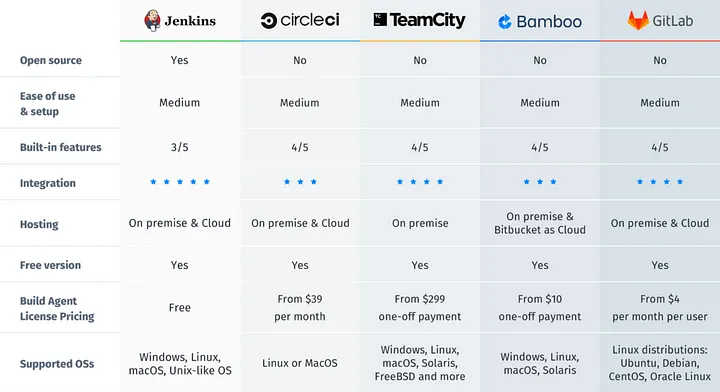
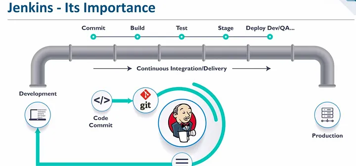

# CI/CD and Jenkins

## What is CI

CI - automates the process of merging/commiting the code to master branch. It automatically builds and tests the new code as it's being merged. Helpes to eliminate any errors or security problems on the early stages.

## Difference between CD and CDE

CD - works together with CI. After code was tested amd merged, CD packages the software and ensures that it is ready to be deployed into production for a client to use.

CDE - allows the deployment of the app automatically, without the need for human intervention. DevOps sets the criteria for code releases, and when those criterias are met and validated, the code is deployed into the production environment.

Main difference is that in CD the deployment is done manually.

## Jenkins and other tools

Tools for CI/CD pipiline:

* Jenkins
* circleci
* TeamCity
* Bamboo
* GitLab

We will be using Jenkins!

Jenkins is an open source automation server in which the central build and CI process take place.

Benefits of Jenkins:
* range of plugins
* easy installation and user-friendly
* huge community and resources
* easy environment configuration
